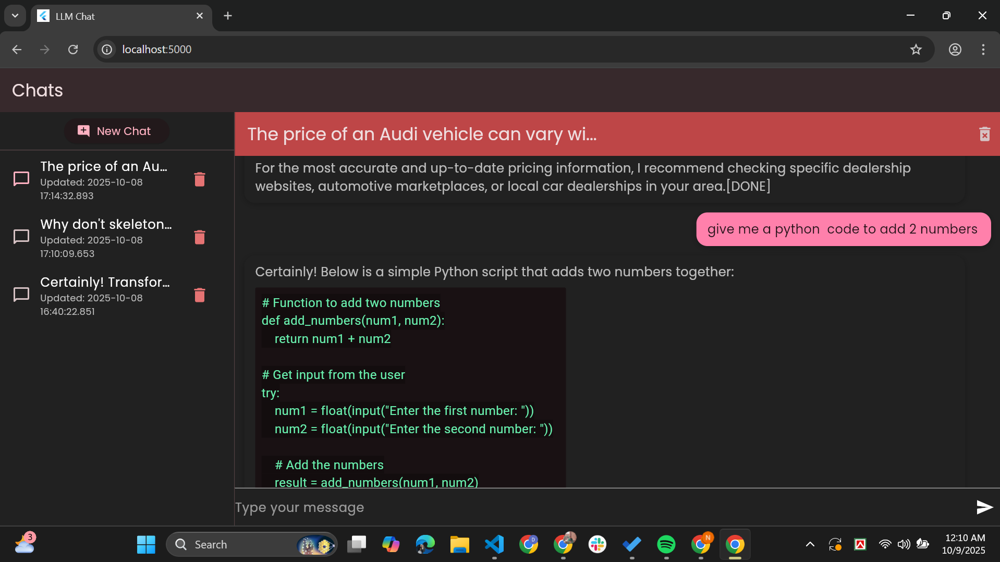

# 💬 ChatApp LLM

A modern **Flutter-based AI Chat Application** powered by local or remote LLMs (Large Language Models) using LM Studio.  
It features a clean UI, real-time markdown responses (headings, bullet points, code blocks, emojis), and persistent chat sessions using **Hive**.

---

## 🚀 Features

- 🧠 AI-powered chat responses (Markdown formatted)  
- 💾 Persistent chat sessions (Hive storage)  
- ✨ Modern dark & pink UI design  
- 📜 Selectable and copyable AI responses  
- 🔄 Auto-scroll during new messages  
- 🗂️ Multi-session tab support  

---

## 🖼️ App Preview

> Add your screenshot below (recommended size: 1080×1920)

<p align="center">
  
</p>
---

## 🛠️ Getting Started

To get started with this project:

1. **Clone the repository:**
   ```bash
   git clone https://github.com/yourusername/chatapp_llm.git
   cd chatapp_llm
